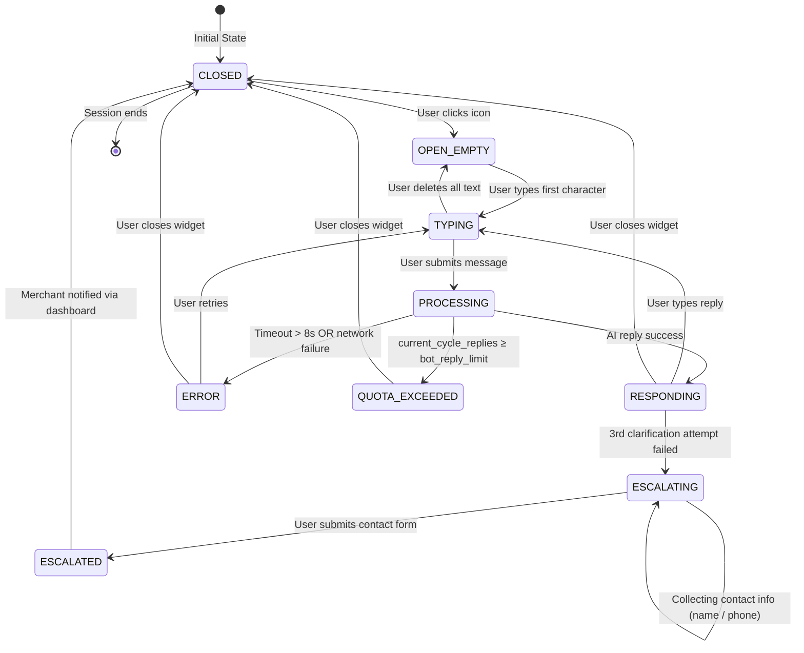

# Widget State Machine

يصف هذا المخطط الحالات السبع لـ Chat Widget وانتقالاتها.

---

## ملاحظات الحالات

### `CLOSED`
- **UI:** أيقونة MoradBot صغيرة في الزاوية
- **Actions:** Click لفتح الـ widget
- **Side effects:** لا شيء

### `OPEN_EMPTY`
- **UI:** نافذة مفتوحة، رسالة الإفصاح AI مرئية، حقل نص فارغ
- **Actions:** الكتابة، إغلاق النافذة
- **Side effects:** عرض رسالة إفصاح AI عند أول فتح (القاعدة 5)

### `TYPING`
- **UI:** حقل نص نشط، زر إرسال مفعّل
- **Actions:** الإرسال، حذف النص، إغلاق النافذة
- **Side effects:** لا شيء

### `PROCESSING`
- **UI:** مؤشر `...` (dots animation) يظهر في فقاعة البوت
- **Actions:** لا شيء (disabled input)
- **Side effects:** API call إلى `POST /api/chat`، بدء Timer 8 ثوان

### `RESPONDING`
- **UI:** رد البوت ظاهر، حقل نص جاهز للرد
- **Actions:** الكتابة، إغلاق النافذة
- **Side effects:** `increment current_cycle_replies`، تسجيل في `messages` table

### `ESCALATING`
- **UI:** نموذج بيانات التواصل (الاسم، رقم الهاتف)
- **Actions:** ملء النموذج، إرساله
- **Side effects:** إنشاء record في `escalations` table

### `ESCALATED`
- **UI:** رسالة تأكيد "سيتواصل معك التاجر قريباً"
- **Actions:** إغلاق النافذة فقط
- **Side effects:** Real-time notification للداشبورد، تحديث `escalations.status = open`

### `ERROR`
- **UI:** رسالة خطأ احترامية باللغة العربية
- **Actions:** إعادة المحاولة، إغلاق النافذة
- **Side effects:** تسجيل الخطأ في `audit_logs`

### `QUOTA_EXCEEDED`
- **UI:** رسالة "تم الوصول إلى الحد الأقصى لهذا الشهر"
- **Actions:** إغلاق النافذة فقط
- **Side effects:** لا شيء (البوت معطّل لهذا المتجر)
