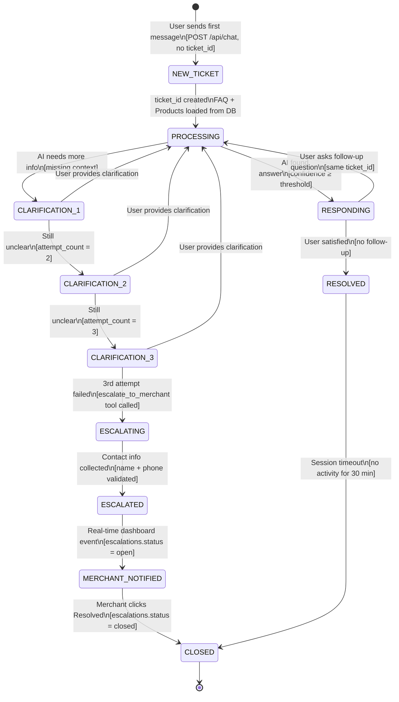

# Conversation Flow

يصف هذا المخطط مسار المحادثة الكاملة من أول رسالة حتى الإغلاق.

---

## شرح الانتقالات (Conditions)

| الانتقال | الشرط |
|----------|-------|
| `NEW_TICKET → PROCESSING` | `ticket_id` غير موجود في الطلب → يُنشأ تلقائياً |
| `PROCESSING → RESPONDING` | الأداة `search_faq_answer` وجدت إجابة |
| `PROCESSING → CLARIFICATION_1` | الأداة لم تجد إجابة كافية |
| `CLARIFICATION_N → PROCESSING` | المستخدم أعاد الكتابة بتفاصيل إضافية |
| `CLARIFICATION_N → CLARIFICATION_N+1` | `attempt_count` يزيد، الذكاء الاصطناعي يطلب توضيحاً مرة أخرى |
| `CLARIFICATION_3 → ESCALATING` | `attempt_count = 3`، يُستدعى `escalate_to_merchant` tool |
| `RESPONDING → RESOLVED` | لا رسالة من المستخدم بعد رد البوت (timeout 30 دقيقة) |
| `RESPONDING → PROCESSING` | المستخدم يرسل رسالة متابعة بنفس الـ `ticket_id` |
| `ESCALATED → MERCHANT_NOTIFIED` | INSERT في `escalations` ينجح → Supabase Realtime يُطلق الحدث |
| `MERCHANT_NOTIFIED → CLOSED` | التاجر يضغط "تم الحل" في الداشبورد |

---

## بيانات المحادثة المخزنة

| الجدول | البيانات المحفوظة |
|--------|-----------------|
| `tickets` | ticket_id، store_id، visitor_id، status، created_at |
| `messages` | كل رسالة (زائر + بوت)، role، content، timestamps |
| `escalations` | بيانات التصعيد، contact info (مشفّرة)، status |
| `usage_tracking` | عدد الردود لكل متجر في الدورة الحالية |
