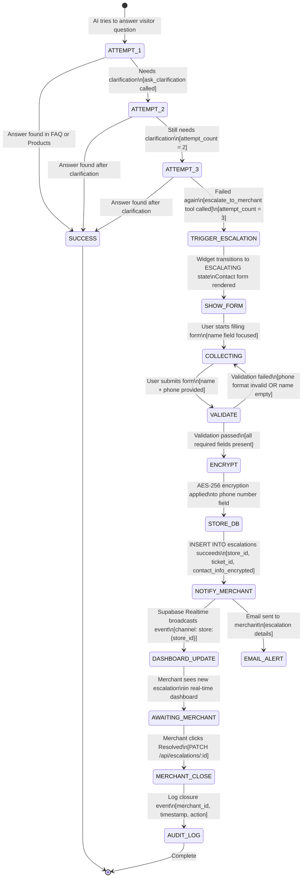

# Escalation Flow

يصف هذا المخطط عملية التصعيد بالتفصيل: من فشل الإجابة حتى إغلاق التاجر للحالة.

---

## ملاحظات الأمان

### تشفير البيانات الحساسة
- رقم الهاتف يُشفَّر بـ **AES-256** قبل الحفظ في `escalations.contact_info`
- مفتاح التشفير يُخزَّن في **Cloudflare Secrets** فقط (لا يظهر في الكود)
- البيانات المشفرة غير قابلة للقراءة حتى مع الوصول المباشر لقاعدة البيانات

### Audit Logging
- كل حدث في عملية التصعيد يُسجَّل في `audit_logs` مع:
  - `store_id`، `actor_id`، `action`، `timestamp`
  - `ip_address` للمستخدم (مشفرة أو مجزأة وفق PDPL)
- السجلات محمية بـ RLS — لا يمكن للتاجر حذفها

### RLS Enforcement
- كل INSERT/SELECT على `escalations` يتطلب `store_id = auth.uid()`
- التاجر يرى فقط تصعيدات متجره الخاص
- Service Role فقط (للنظام) يمكنه الوصول عبر `createSupabaseAdmin()`

---

## شرح الانتقالات

| الانتقال | التفاصيل |
|----------|----------|
| `ATTEMPT_N → SUCCESS` | `search_faq_answer` أو `search_products` أعادت نتيجة |
| `ATTEMPT_3 → TRIGGER_ESCALATION` | `escalate_to_merchant` tool يُستدعى، يُرجع `{ escalated: true }` |
| `VALIDATE → COLLECTING` | الهاتف ليس بصيغة سعودية صحيحة، أو الاسم فارغ |
| `VALIDATE → ENCRYPT` | الحقول المطلوبة جميعها حاضرة وصحيحة |
| `NOTIFY_MERCHANT → DASHBOARD_UPDATE` | Supabase Realtime `INSERT` event على channel `store:{store_id}` |
| `AWAITING_MERCHANT → MERCHANT_CLOSE` | `PATCH /api/escalations/:id` بـ `{ status: "closed" }` |
