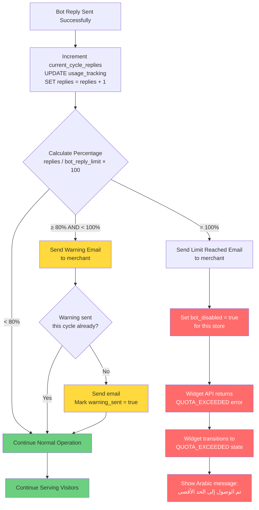

# Usage Metering Flow

يصف هذا المخطط منطق حساب الاستخدام، وإرسال التحذيرات، وقطع الخدمة عند الوصول للحد الأقصى.



---

## خطط الاشتراك والحدود

| الخطة | `bot_reply_limit` | `sync_frequency_hours` | السعر |
|-------|-------------------|------------------------|-------|
| Basic | يُحدد بالخطة | 24 ساعة | — |
| Mid | يُحدد بالخطة | 6 ساعات | — |
| Premium | يُحدد بالخطة | 1 ساعة | — |

> القيم الفعلية مُعرَّفة في جدول `plans` في قاعدة البيانات.

---

## بيانات المتابعة في قاعدة البيانات

### جدول `usage_tracking`
```sql
-- كل صف يمثل دورة شهرية لمتجر واحد
store_id          UUID     -- ربط بالمتجر
cycle_start       DATE     -- بداية الدورة
cycle_end         DATE     -- نهاية الدورة
bot_replies_used  INTEGER  -- عدد الردود الفعلية
warning_sent      BOOLEAN  -- هل أُرسل تحذير الـ 80%؟
```

---

## منطق التحقق في Middleware (`beforeModel` Callback)

```typescript
// يُنفَّذ قبل كل طلب للـ AI
const usagePercent = (currentReplies / botReplyLimit) * 100;

if (usagePercent >= 100) {
  throw new QuotaExceededError(); // → Widget: QUOTA_EXCEEDED
}
// إذا < 100%، يستمر الطلب بشكل طبيعي
```

---

## دورة الفوترة (Billing Cycle)

- الدورة: **شهرية** تبدأ من تاريخ الاشتراك
- عند التجديد: `current_cycle_replies` يُعاد إلى صفر
- التجديد يدوي (يدفع التاجر) — لا تجديد تلقائي في MVP
