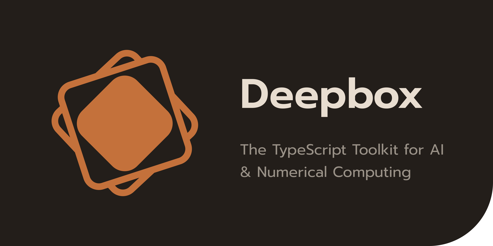

# Deepbox
https://github.com/jehaad1/Deepbox.git
## The TypeScript Toolkit for AI & Numerical Computing

[](https://github.com/jehaad1/Deepbox/actions/workflows/ci.yml)
[](https://www.npmjs.com/package/deepbox)
[](LICENSE)

Deepbox is a comprehensive, type-safe TypeScript library that unifies numerical computing, tabular data workflows, and machine learning into a single modular package. Zero runtime dependencies. 4,344 tests. Production-ready.

> **Documentation:** https://deepbox.dev/docs · **Examples:** https://deepbox.dev/examples · **Projects:** https://deepbox.dev/projects

## Requirements

- Node.js `>= 24.13.0`

## Installation

```bash
npm install deepbox
```

## Quick Start

```ts
import { tensor, add, parameter } from "deepbox/ndarray";
import { DataFrame } from "deepbox/dataframe";
import { LinearRegression } from "deepbox/ml";

// Tensor operations with broadcasting
const a = tensor([
  [1, 2],
  [3, 4],
]);
const b = tensor([
  [5, 6],
  [7, 8],
]);
const c = add(a, b); // tensor([[6, 8], [10, 12]])

// Automatic differentiation
const x = parameter([2, 3]);
const y = x.mul(x).sum();
y.backward();
// x.grad -> tensor([4, 6])

// DataFrame operations
const df = new DataFrame({
  name: ["Alice", "Bob", "Charlie"],
  age: [25, 30, 35],
  score: [85, 90, 78],
});

// Machine learning
const model = new LinearRegression();
model.fit(XTrain, yTrain);
const predictions = model.predict(XTest);
```

Prefer per-module imports for tree-shaking, or use namespaces from the root:

```ts
import * as db from "deepbox";
const t = db.ndarray.tensor([1, 2, 3]);
```

## Modules

| Module               | What it provides                                                                       | Docs                                                       |
| -------------------- | -------------------------------------------------------------------------------------- | ---------------------------------------------------------- |
| `deepbox/core`       | Types, errors, validation, dtype helpers, configuration                                | [core](https://deepbox.dev/docs/core-types)                |
| `deepbox/ndarray`    | N-D tensors with autograd, broadcasting, 90+ ops, sparse matrices                      | [ndarray](https://deepbox.dev/docs/ndarray-tensor)         |
| `deepbox/linalg`     | SVD, QR, LU, Cholesky, eigenvalue decomposition, solvers, norms                        | [linalg](https://deepbox.dev/docs/linalg-decompositions)   |
| `deepbox/dataframe`  | DataFrame + Series with 50+ operations, CSV I/O                                        | [dataframe](https://deepbox.dev/docs/dataframe-overview)   |
| `deepbox/stats`      | Descriptive stats, correlations, hypothesis tests (t-test, ANOVA, chi-square, etc.)    | [stats](https://deepbox.dev/docs/stats-descriptive)        |
| `deepbox/metrics`    | 40+ ML metrics (classification, regression, clustering)                                | [metrics](https://deepbox.dev/docs/metrics-classification) |
| `deepbox/preprocess` | Scalers, encoders, normalizers, cross-validation splits                                | [preprocess](https://deepbox.dev/docs/preprocess-scalers)  |
| `deepbox/ml`         | Classical ML (Linear, Ridge, Lasso, Logistic, Trees, SVM, KNN, Naive Bayes, Ensembles) | [ml](https://deepbox.dev/docs/ml-linear)                   |
| `deepbox/nn`         | Neural networks (Linear, Conv, RNN/LSTM/GRU, Attention, Normalization, Losses)         | [nn](https://deepbox.dev/docs/nn-module)                   |
| `deepbox/optim`      | Optimizers (SGD, Adam, AdamW, RMSprop, etc.) + LR schedulers                           | [optim](https://deepbox.dev/docs/optim-optimizers)         |
| `deepbox/random`     | Distributions (uniform, normal, binomial, gamma, beta, etc.) + sampling                | [random](https://deepbox.dev/docs/random-distributions)    |
| `deepbox/datasets`   | Built-in datasets (Iris, Digits, Breast Cancer, etc.) + synthetic generators           | [datasets](https://deepbox.dev/docs/datasets-builtin)      |
| `deepbox/plot`       | SVG/PNG plotting (scatter, line, bar, hist, heatmap, contour, ML plots)                | [plot](https://deepbox.dev/docs/plot-basic)                |

## Features

### N-Dimensional Arrays

- **90+ operations**: arithmetic, trigonometric, logical, reductions, sorting, manipulation
- **Automatic differentiation**: `GradTensor` with reverse-mode backpropagation
- **Broadcasting**: full broadcasting semantics ([docs](https://deepbox.dev/docs/ndarray-ops))
- **Sparse matrices**: CSR format with arithmetic and matrix operations
- **Multiple dtypes**: float32, float64, int32, int64, uint8, bool, string
- **Activation functions**: ReLU, Sigmoid, Softmax, GELU, Mish, Swish, ELU, LeakyReLU

### DataFrames & Series

- **Tabular API**: filtering, grouping, joining, merging, pivoting, sorting ([docs](https://deepbox.dev/docs/dataframe-overview))
- **CSV I/O**: read and write CSV files
- **Descriptive statistics**: `describe()`, value counts, correlation matrices

### Linear Algebra

- **Decompositions**: SVD, QR, LU, Cholesky, Eigenvalue (eig, eigh, eigvals, eigvalsh)
- **Solvers**: `solve()`, `lstsq()`, `solveTriangular()`
- **Properties**: `det()`, `trace()`, `matrixRank()`, `cond()`, `slogdet()`
- **Norms**: `norm()` (L1, L2, Frobenius, nuclear, inf)
- **Inverse**: `inv()`, `pinv()`

### Statistics

- **Descriptive**: mean, median, mode, variance, std, skewness, kurtosis, quantile, percentile
- **Correlations**: Pearson, Spearman, Kendall tau
- **Hypothesis tests**: t-tests (1-sample, independent, paired), ANOVA, chi-square, Shapiro-Wilk, Mann-Whitney U, Kruskal-Wallis, Friedman, Anderson-Darling, KS test
- **Variance tests**: Levene, Bartlett

### Machine Learning

- **Linear models**: LinearRegression, Ridge, Lasso, LogisticRegression
- **Tree-based**: DecisionTreeClassifier/Regressor, RandomForestClassifier/Regressor
- **Ensemble**: GradientBoostingClassifier/Regressor
- **SVM**: LinearSVC, LinearSVR
- **Neighbors**: KNeighborsClassifier, KNeighborsRegressor
- **Naive Bayes**: GaussianNB
- **Clustering**: KMeans, DBSCAN
- **Dimensionality reduction**: PCA, t-SNE

### Neural Networks

- **Layers**: Linear, Conv1d, Conv2d, MaxPool2d, AvgPool2d
- **Recurrent**: RNN, LSTM, GRU
- **Attention**: MultiheadAttention, TransformerEncoderLayer
- **Normalization**: BatchNorm1d, LayerNorm
- **Regularization**: Dropout
- **Activations**: ReLU, Sigmoid, Tanh, GELU, Mish, Swish, Softmax, LogSoftmax, ELU, LeakyReLU, Softplus
- **Losses**: mseLoss, maeLoss, crossEntropyLoss, binaryCrossEntropyLoss, binaryCrossEntropyWithLogitsLoss, huberLoss, rmseLoss
- **Containers**: Sequential

### Optimization

- **Optimizers**: SGD (with momentum), Adam, AdamW, Nadam, RMSprop, Adagrad, AdaDelta
- **LR Schedulers**: StepLR, MultiStepLR, ExponentialLR, CosineAnnealingLR, LinearLR, OneCycleLR, ReduceLROnPlateau, WarmupLR

### Preprocessing

- **Scalers**: StandardScaler, MinMaxScaler, RobustScaler, MaxAbsScaler, Normalizer, PowerTransformer, QuantileTransformer
- **Encoders**: LabelEncoder, OneHotEncoder, OrdinalEncoder, LabelBinarizer, MultiLabelBinarizer
- **Splitting**: trainTestSplit, KFold, StratifiedKFold, GroupKFold, LeaveOneOut, LeavePOut

### Visualization

- **Plot types**: scatter, line, bar, histogram, heatmap, contour, box plot, violin plot, pie chart
- **ML plots**: confusion matrix, ROC curve, precision-recall curve, learning curves, validation curves, decision boundaries
- **Output**: SVG (browser + Node.js), PNG (Node.js only)

## Examples

### Automatic Differentiation

```ts
import { parameter } from "deepbox/ndarray";

const x = parameter([
  [1, 2],
  [3, 4],
]);
const w = parameter([[0.5], [0.5]]);
const y = x.matmul(w).sum();
y.backward();
// x.grad -> gradients w.r.t. x
// w.grad -> gradients w.r.t. w
```

### Neural Network Training

```ts
import { Sequential, Linear, ReLU, Dropout, mseLoss } from "deepbox/nn";
import { Adam } from "deepbox/optim";

const model = new Sequential(
  new Linear(10, 64),
  new ReLU(),
  new Dropout(0.2),
  new Linear(64, 32),
  new ReLU(),
  new Linear(32, 1),
);

const optimizer = new Adam(model.parameters(), { lr: 0.001 });

for (let epoch = 0; epoch < 100; epoch++) {
  const output = model.forward(xTrain);
  const loss = mseLoss(output, yTrain);
  optimizer.zeroGrad();
  loss.backward();
  optimizer.step();
}
```

### ML Pipeline

```ts
import { trainTestSplit, StandardScaler } from "deepbox/preprocess";
import { RandomForestClassifier } from "deepbox/ml";
import { accuracy, f1Score } from "deepbox/metrics";

const [XTrain, XTest, yTrain, yTest] = trainTestSplit(X, y, {
  testSize: 0.2,
  randomState: 42,
});

const scaler = new StandardScaler();
scaler.fit(XTrain);
const XTrainScaled = scaler.transform(XTrain);
const XTestScaled = scaler.transform(XTest);

const model = new RandomForestClassifier({ nEstimators: 100, maxDepth: 10 });
model.fit(XTrainScaled, yTrain);

const yPred = model.predict(XTestScaled);
console.log("Accuracy:", accuracy(yTest, yPred));
console.log("F1 Score:", f1Score(yTest, yPred));
```

### Classical ML Models

```ts
import {
  DecisionTreeClassifier,
  GradientBoostingClassifier,
  KNeighborsClassifier,
  LinearSVC,
} from "deepbox/ml";

const tree = new DecisionTreeClassifier({ maxDepth: 5 });
tree.fit(XTrain, yTrain);

const gb = new GradientBoostingClassifier({
  nEstimators: 100,
  learningRate: 0.1,
});
gb.fit(XTrain, yTrain);

const knn = new KNeighborsClassifier({ nNeighbors: 5 });
knn.fit(XTrain, yTrain);

const svm = new LinearSVC({ C: 1.0 });
svm.fit(XTrain, yTrain);
```

### DataFrame Operations

```ts
import { DataFrame } from "deepbox/dataframe";

const df = new DataFrame({
  name: ["Alice", "Bob", "Charlie", "David"],
  age: [25, 30, 35, 28],
  salary: [50000, 60000, 75000, 55000],
  department: ["IT", "HR", "IT", "HR"],
});

const itDept = df.filter((row) => row.department === "IT");
const avgSalary = df.groupBy("department").agg({ salary: "mean" });
const sorted = df.sort("salary", false);
```

### Plotting

```ts
import { scatter, plot, hist, heatmap, saveFig } from "deepbox/plot";
import { tensor } from "deepbox/ndarray";

scatter(tensor([1, 2, 3, 4, 5]), tensor([2, 4, 5, 4, 6]), { color: "#1f77b4" });
plot(tensor([1, 2, 3, 4, 5]), tensor([2, 4, 5, 4, 6]), { color: "#ff7f0e" });
hist(tensor([1, 2, 2, 3, 3, 3, 4, 4, 5]), { bins: 5 });
heatmap(
  tensor([
    [1, 2, 3],
    [4, 5, 6],
    [7, 8, 9],
  ]),
);
saveFig("output.svg");
```

## Performance

Deepbox is pure TypeScript — no native addons, no WebAssembly, no C bindings. Every operation runs on V8’s JIT compiler with `TypedArray` backing. Despite competing against Python libraries that use hand-tuned C and Fortran backends (BLAS, LAPACK, ATen), Deepbox delivers competitive or superior performance in several areas.

**542 head-to-head benchmarks** across 10 categories, tested on the same machine with identical data sizes and iteration counts:

| Category | Deepbox Wins | Python Package Wins | Competing Against |
| --- | ---: | ---: | --- |
| DataFrames | 23 | 32 | Pandas (C / Cython) |
| Datasets | 11 | 30 | scikit-learn |
| Linear Algebra | 0 | 54 | NumPy + SciPy (LAPACK) |
| Metrics | 46 | 17 | scikit-learn (C / Cython) |
| ML Training | 15 | 33 | scikit-learn (C / Cython) |
| NDArray Ops | 6 | 88 | NumPy (C / BLAS) |
| Plotting | 43 | 0 | Matplotlib (C / Agg) |
| Preprocessing | 19 | 24 | scikit-learn (C / Cython) |
| Random | 0 | 44 | NumPy (C) |
| Statistics | 30 | 27 | SciPy (C / Fortran) |
| **Total** | **193** | **349** | |

### Where Deepbox shines

- **bar** (200 bars) — 9963.3x faster *(Plotting)*
- **transpose** (500x500) — 54.5x faster *(NDArray Ops)*
- **KNeighborsRegressor fit** (200x5) — 36.6x faster *(ML Training)*
- **fbetaScore (β=0.5)** (1K) — 30.9x faster *(Metrics)*
- **describe** (100x5) — 29.5x faster *(DataFrames)*
- **chisquare** (10 bins) — 19.3x faster *(Statistics)*
- **loadLinnerud** (20x3) — 15.1x faster *(Datasets)*
- **PowerTransformer fit** (500x10) — 6.4x faster *(Preprocessing)*

### Context

Python’s numerical libraries delegate heavy lifting to compiled C/Fortran code (OpenBLAS, MKL, LAPACK). Deepbox implements everything in TypeScript, relying on V8’s TurboFan JIT and `Float64Array` for performance. The gap is largest for BLAS-bound operations (matmul, decompositions) and smallest for memory-layout operations (transpose, reshape, indexing) where Deepbox’s lazy-view architecture has an advantage.

> Run `npm run bench:all` to reproduce. Full results in [`benchmarks/RESULTS.md`](benchmarks/RESULTS.md).

## Development

See [CONTRIBUTING.md](CONTRIBUTING.md) for the full development workflow.

```bash
npm install         # Install dependencies
npm run build       # Build the package
npm test            # Run 4,344 tests
npm run typecheck   # Type checking
npm run lint        # Lint with Biome
npm run format      # Format with Biome
npm run all         # Run all checks
```

## License

MIT License — see [LICENSE](LICENSE) for details.

---

Built by [Jehaad Aljohani](https://github.com/jehaad1)
